# 🗺️ Project Workflow & Architecture

## Pipeline Flow Diagram

## Technology Stack Diagram

```mermaid
graph LR
    subgraph Frontend["📊 Frontend"]
        PBI[Power BI]
    end

    subgraph Backend["⚙️ Backend"]
        PY[Python 3.11]
        PD[Pandas]
        SA[SQLAlchemy]
        RQ[Requests]
    end

    subgraph AI["🤖 AI/ML"]
        OAI[OpenAI API]
        GPT[GPT-4o-mini]
        NLP[Rule-Based NLP]
    end

    subgraph Database["🗄️ Database"]
        PG[(PostgreSQL)]
    end

    subgraph Cloud["☁️ Cloud"]
        LAM[AWS Lambda]
        EB[EventBridge]
        S3[S3]
    end

    PY --> PD
    PY --> SA
    PY --> RQ
    PY --> OAI
    OAI --> GPT
    PY --> NLP
    SA --> PG
    PG --> PBI
    LAM --> PY
    EB --> LAM
    LAM --> S3

    style Frontend fill:#fff8e1
    style Backend fill:#e3f2fd
    style AI fill:#f3e5f5
    style Database fill:#e8f5e9
    style Cloud fill:#fce4ec
```

## Data Flow Sequence

```mermaid
sequenceDiagram
    participant API as 🌐 Job APIs
    participant PY as 🐍 Python
    participant NLP as 📋 Rule-Based
    participant LLM as 🤖 GPT-4
    participant DB as 🗄️ PostgreSQL
    participant PBI as 📊 Power BI

    Note over API,PBI: Weekly Pipeline Execution
    
    PY->>API: Request jobs (Adzuna, Remotive)
    API-->>PY: Return 18,000+ jobs
    
    PY->>PY: Deduplicate & classify sectors
    PY->>DB: Store raw jobs (v2_jobs)
    
    PY->>NLP: Extract explicit skills
    NLP-->>PY: Return 27,000 skills
    PY->>DB: Store skills (v2_job_skills)
    
    PY->>LLM: Enrich with context
    LLM-->>PY: Return 3,500 inferred skills
    PY->>DB: Store LLM skills (v2_job_skills)
    
    PBI->>DB: Query all tables
    DB-->>PBI: Return data
    PBI->>PBI: Render 4-page dashboard
```

## Project Timeline

## Skills Extraction Comparison

## Jobs by Sector

## Salary Distribution

